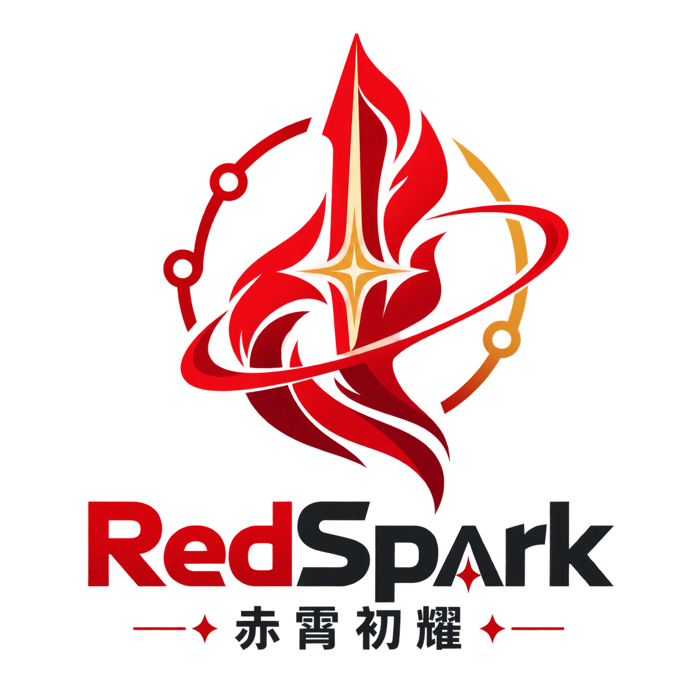

# RedSpark 模型资产

`model/redspark/` 是 RedSpark 自有的模型源码边界，`model/redspark/model-weights/` 是权重资产边界。当前 `baseline-v1` 形状与上游 `openbmb/MiniCPM5-2B` 的标准 LLaMA 解码器兼容，用于验证权重迁移、推理和训练闭环。

上游 MiniCPM 的模型卡、许可证和配置文件保留在 `model/redspark/model-weights/base/`，用于记录权重来源和使用边界；上游参考源码在 `third_party/MiniCPM/`，RedSpark 自有模型源码在 `model/redspark/`。

权重二进制不进版本库。两个权重目录各自保留 `config.json`、`tokenizer.json`、`chat_template.jinja` 作为溯源，权重本身用 `tools/model_weights.py download` 拉取、`clean` 卸载。卸载时该工具会一并检查 `.git/lfs/objects/` 下的 Git LFS 副本——只删工作区文件不会释放空间。

模型资产目录中的 README 在顶部增加了 RedSpark 本地产品说明，并保留 MiniCPM 官方模型卡链接。这样既能以 RedSpark 名称使用模型，也不会混淆上游模型身份、许可证和技术信息。
